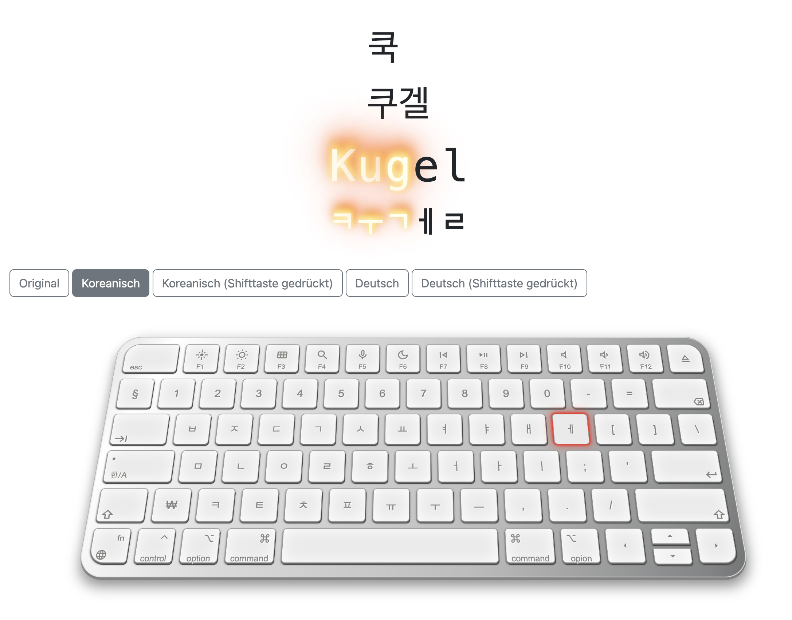

# Fire Up Koreanish Alphabets 
### Korean Typing Website for German
This web application is designed to help users practice Korean typing skills within a German context. "Fire Up Koreanish Alphabets" is a project designed to facilitate German speakers in practicing Korean typing with clear and visually intuitive signals. This repository provides a user-friendly interface for German speakers who are learning to type in Korean, offering visual cues and prompts to enhance the learning experience. 

For livedemo please visit [@here](https://techxxxy.github.io/fire-up-koreanisch-alphabet/).

## Features

- **Automatic Korean Input**: All keyboard input is automatically converted to Korean characters for seamless typing.
- **Animation Effects**: Engaging animation effects provide visual feedback when input matches the target text.
- **Multiple Keyboard Layouts**: Choose from multiple keyboard layouts, including Korean-German hybrid, small caps German, big caps German, standard Korean, and shifted Korean.

## Technologies Used

- [Hangul.js](https://github.com/e-/Hangul.js/) - JavaScript library for handling Korean characters.
- [Google Material Icons](https://material.io/resources/icons/) - Icon library provided by Google for modern web design.
- [Google Fonts](https://fonts.google.com/) - Collection of open-source fonts provided by Google for use in web projects.
- [Bootstrap](https://getbootstrap.com/) - Front-end framework for building responsive websites.
- HTML, CSS, JavaScript

